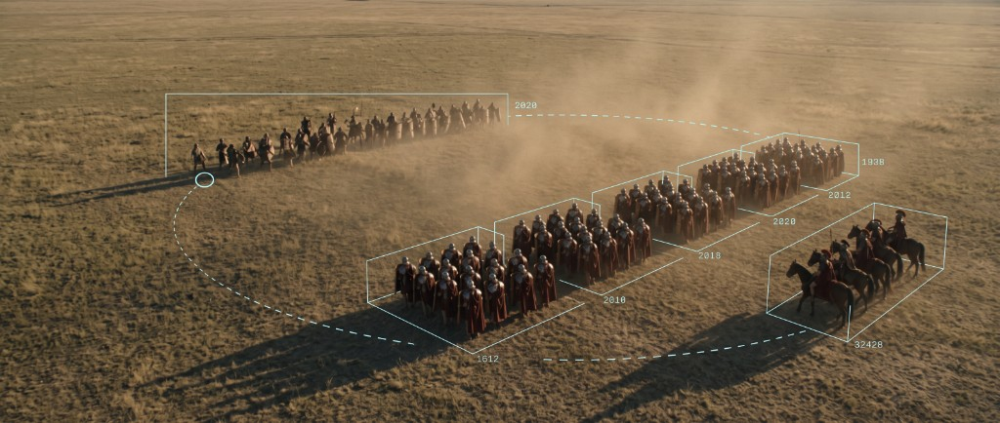

# Comstar Game AI

**An opponent for Total War: Rome Remastered that plays the game rather than cheating at it.**

> **Status: phases 0–3 complete, phase 4 (battle loop) next.** Design is recorded in [`docs/`](docs/); [`docs/cursor-handoff.md`](docs/cursor-handoff.md) is the build brief.

---

## Why

Anyone who has played a Total War game has the same story. You bait the AI into a river crossing and it walks in anyway. You leave a city undefended for fifteen turns and nobody comes. You win a battle you should have lost because the enemy general charged your spears alone, again.

And when the AI does beat you, it usually got a difficulty bonus to do it. Every Total War player knows this, and knowing it takes something away from the win.

So the question this project asks is narrow and specific: **can you build an opponent that is hard to beat without giving it anything a human does not have?**

Not a bot with fog of war switched off and a gold cheat running. One that sees what you see, learns from what happens, and has to earn it.

## What it actually is

A local application on a Windows machine that reads Rome Remastered through its own scripting and console interfaces, drives it with synthetic keyboard and mouse, and consults a language model for strategy through [Agentic Orchestration](https://github.com/zlatko-lakisic/agentic-orchestration).

It does not read game memory. It does not inject into the process. It does not use a single cheat command. It plays through the same surface a person does, just without ever getting bored.

## The three ideas that make it work

**Time stops so the machine can think.** Rome has a console command, `toggle_game_update`, that freezes the battle simulation. That single fact turns a real-time game into a turn-based one, which is the only reason language-model reasoning is viable in a battle at all. Freeze, read the field, decide, issue orders, resume. The agent thinks in seconds and the battle never notices.

**The model picks the objective, not the moves.** It never selects an action. It declares what result it wants from a battle: destroy this army completely and spend up to 40 percent of mine doing it, or hold this ridge for four minutes, or bleed them and get out intact. Aggression is then computed from that target rather than asserted as a mood. And because the target is measurable, you can check afterwards whether it got what it said it wanted.

**Nobody writes down what a good move is.** There is no hand-tuned evaluation function saying material is worth 1.4 times tempo. The game decides. Rome computes faction scores, tracks rankings, reports casualties and routs and siege outcomes, and all of that is the ground truth. The agent's opinions are hypotheses; the outcome log is the judge.

## It learns by watching, not just by playing

A campaign is 200 turns with twenty-odd AI factions all making decisions. That is roughly **four thousand faction-turns of observable consequence per campaign**, collected without the agent risking anything and without it needing to be any good yet.

The native AI is a physics teacher rather than a strategy teacher: it reliably demonstrates what happens when an army of one composition assaults a settlement of another, which is exactly the causal texture a value model needs. Its strategic judgement is weighted near zero, for reasons the first paragraph of this README covers.

The learning signal is **prediction error, not outcome**. Winning a battle you should have won easily, at heavy cost, is a bad result. A battle that went exactly as expected teaches nothing and is not worth remembering. Surprise is the whole signal.

## The rules it plays by

Enforced in code, not by good intentions:

| | |
|---|---|
| **Fog of war** | It sees what a player sees. It holds beliefs, not facts, and every belief carries an age and a confidence that decays |
| **No cheats, ever** | `add_money`, `auto_win`, `force_battle_victory`, `toggle_fow`, `toggle_perfect_spy` and friends are in a hard-blocked set. A run that touches them is tainted and marked |
| **It says what it is going to do** | Every action is declared before it executes. No approval gate, nothing waits, but the record exists |
| **Single player only** | Automating multiplayer is cheating other people, which is a different thing entirely |

The one advantage it does take is mechanical: it freezes and micros every unit on every tick, which no human can do. That is a deliberate decision rather than an oversight, and the tick rate is a configurable dial.

## Built on Agentic Orchestration

| Project | Role here |
|---------|-----------|
| [agentic-orchestration](https://github.com/zlatko-lakisic/agentic-orchestration) | The engine. Model-agnostic catalogs, dynamic planning, RAG sources, agent skills. Runs on a separate box beside the model |
| [agentic-orchestration-reach](https://github.com/zlatko-lakisic/agentic-orchestration-reach) | The client SDK. Session overlays register ephemeral `client.*` agents for a match; a reverse WebSocket tunnel exposes local game state to the engine without opening a port |
| [FeralInteractive/romeremastered](https://github.com/FeralInteractive/romeremastered) | Feral's official modding documentation, which publishes the combat and campaign formulae the deterministic predictors are built from |

The game process is the host and AO is a service it consults, never the other way around. A move is never blocked waiting on a model.

## Documentation

| File | What is in it |
|------|---------------|
| [`docs/cursor-handoff.md`](docs/cursor-handoff.md) | The build brief. Constraints, architecture, build order, open questions |
| [`docs/decisions.md`](docs/decisions.md) | Twelve architecture decisions with their consequences, and the risk register |
| [`docs/design/rtw-remastered-integration.md`](docs/design/rtw-remastered-integration.md) | Observation channels, actuation tiers, game state machine, fair play boundary |
| [`docs/design/host-app-architecture.md`](docs/design/host-app-architecture.md) | Capture, input injection, process split, safety layer |
| [`docs/design/host-overlay-ui.md`](docs/design/host-overlay-ui.md) | The on-screen overlay, and how it stays out of the screenshots |
| [`docs/design/reach-overlay-design.md`](docs/design/reach-overlay-design.md) | Session overlay, run modes, connection config, call patterns |
| [`docs/design/bottlenecks.md`](docs/design/bottlenecks.md) | Eight constraints with the arithmetic behind each |
| [`docs/design/smart-player-architecture.md`](docs/design/smart-player-architecture.md) | The general design this specialises |
| [`docs/images/overlay-mockup.html`](docs/images/overlay-mockup.html) | What the screen looks like while it plays |

## A note on the hard part

The interesting engineering here is not the model. It is that Windows will lie to you.

`SendInput` can be blocked by UIPI, and Microsoft document that neither the return value nor `GetLastError` will tell you. The click reports success. The game does nothing. An overlay that forgets to be click-through produces the identical symptom. So does acting during a loading screen, or with a modal open.

Which is why every action in this system is a closed loop: declare, execute, verify by observation, retry. Not because it is elegant, but because the alternative is a system that appears to work and does not.

---

Apache-2.0, same as the engine. Not affiliated with Creative Assembly, Feral Interactive or SEGA.
