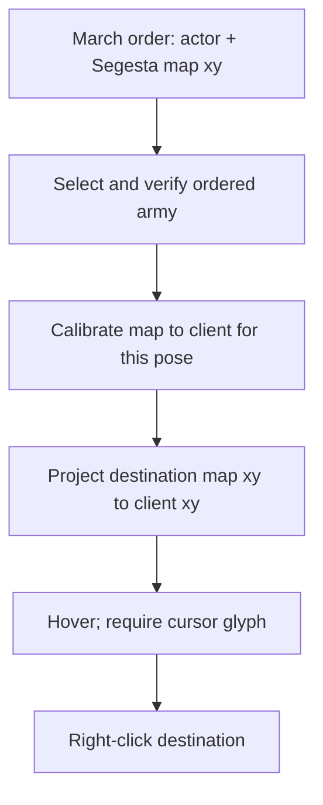
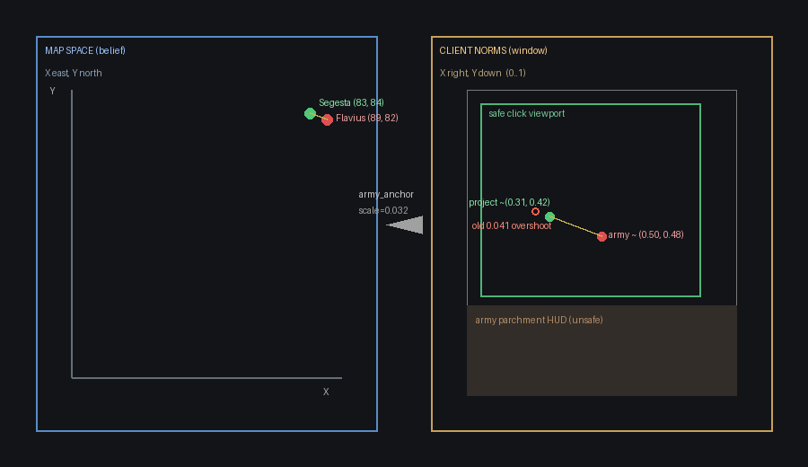
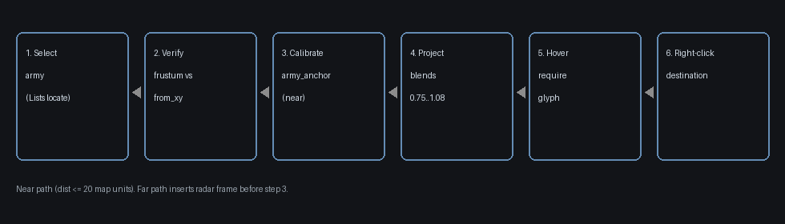
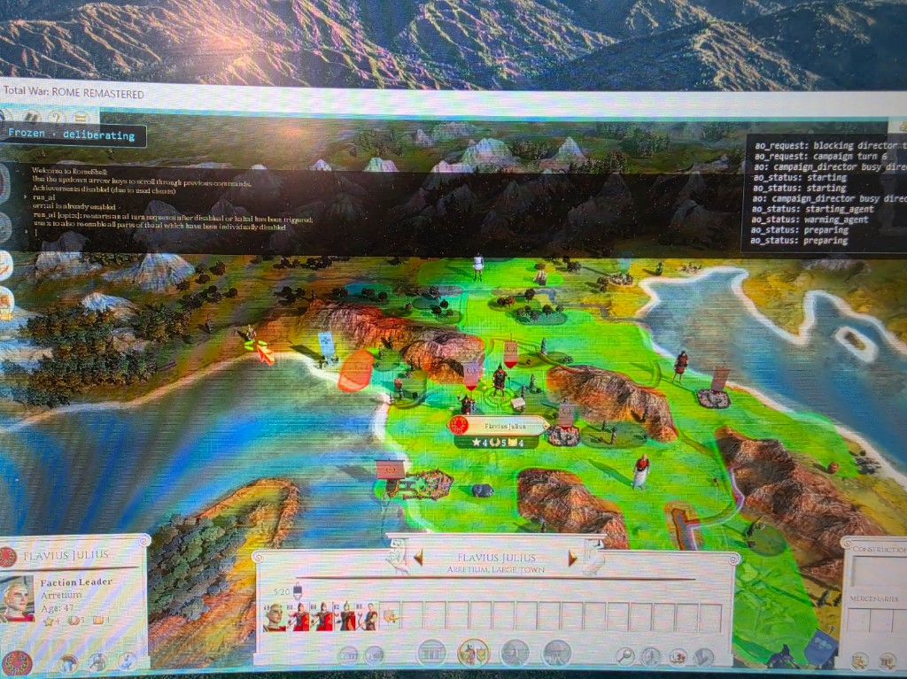
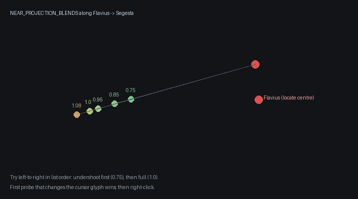

# Map→window projection for campaign marches

How belief coordinates on the Rome map become mouse clicks in the Remastered window — and why that path exists.

## Why this exists

The campaign director (AO) thinks in **map space**:

| Who / what | Belief map XY |
|---|---|
| Flavius Julius | `(89, 82)` |
| Segesta | `(83, 84)` |

The game only accepts input in **client-normalised window coordinates** `(0..1, 0..1)` relative to the Rome client rect. A click at map `(83, 84)` is meaningless until the **current camera pose** turns it into something like `(0.31, 0.42)`.

Older code assumed Lists-locate had put the army at screen centre and **left-clicked** along a fixed bearing. That failed when:

1. the wrong Lists row was selected (Amulius instead of Flavius),
2. the camera was elsewhere,
3. a left-click hit a nameplate and **selected the town** instead of ordering a march.

Remastered issues move / attack / besiege on a **right-click** once the cursor glyph changes (boots / sword).


```mermaid
flowchart TD
  order[March order: actor + Segesta map xy]
  select[Select and verify ordered army]
  calib[Calibrate map to client for this pose]
  project[Project destination map xy to client xy]
  hover[Hover; require cursor glyph]
  actuate[Right-click destination]
  order --> select --> calib --> project --> hover --> actuate
```

---

## Two coordinate spaces



### Map space (belief)

- Comes from start-position / `list_characters` style data stored in the belief store.
- **X increases east**, **Y increases north** (Rome convention).
- Independent of zoom, pan, or which monitor the window sits on.

### Client norms (window)

- `(0, 0)` = top-left of the **client area** (not the monitor).
- **X increases right**, **Y increases down**.
- Converted to screen pixels via `ClientToScreen` before `SendInput`.

Safe click region (must stay out of HUD / radar):

```text
DEFAULT_VIEWPORT_BOUNDS = (0.08, 0.10, 0.82, 0.58)
# left, top, right, bottom — bottom capped above the army parchment
```

---

## End-to-end pipeline



| Step | What happens | Failure = refuse |
|---|---|---|
| 1. Select | Lists → Military Forces → row → locate | No unit cards |
| 2. Verify | Radar frustum centre ≈ ordered `from_xy` | Wrong army (e.g. Amulius) |
| 3. Calibrate | Build a `MapClientTransform` for **this** pose | Cannot fit / no fallback |
| 4. Project | Map destination → client XY (with blends) | Outside safe viewport |
| 5. Glyph | Hover until cursor handle ≠ baseline | Open land / HUD / water |
| 6. Actuate | **Right-click** | No controller / no screen coords |

Primary code:

- [`map_projection.py`](../../src/comstar_game_ai/game_io/campaign/map_projection.py) — math + radar helpers  
- [`march.py`](../../src/comstar_game_ai/game_io/campaign/march.py) — gates + click path  
- Config: `campaign.march.use_map_projection: true` (legacy bearing probes off by default)

---

## Calibration modes (how map becomes client)

Ideal path (plan Phase 0): hover known client points → `show_cursorstat` → affine fit.  
**Live Remastered spike:** `show_cursorstat` is console-pane-only — nothing useful lands in `message_log` / `scripting_log`. So we do **not** ship assumed-centre geometry as the “better” path; we use these fallbacks:

### A. Army-anchor (near marches — primary today)

After Lists-locate, Rome frames the ordered stack near screen centre. We treat:

```text
army map xy  →  client (0.50, 0.48)
```

and apply a north-up similarity:

```text
x_client = 0.50 + scale * (x_map - x_army)
y_client = 0.48 + scale * (-1) * (y_map - y_army)
```

`DEFAULT_ANCHOR_SCALE` = **client-norms per map unit** at the canonical pose.

| Scale | Meaning |
|---|---|
| `0.0133` (current, Z7 @ N=14) | `0.74 / 55.6` after landed Flavius march @ 1280×720 |
| `0.032` (historical) | Closer uncontrolled zoom; Segesta near-case |
| `0.0092` (void) | Overlay-pose fit — never restore |

**Worked example — historical Flavius → Segesta (pre-Arretium save)**

```text
army   = (89, 82)
dest   = (83, 84)
Δ      = (-6, +2)          # 6 west, 2 north
scale  = 0.032

x = 0.50 + 0.032 * (-6) = 0.308
y = 0.48 + 0.032 * (-1) * (+2) = 0.416

→ project ≈ (0.31, 0.42)
```

That lands **west of Flavius, above the army HUD** — the same side of the screen as Segesta.

### B. Dest-anchor (after radar frame)

For **far** targets (`map distance > 20`), we radar-click the destination belief point so it should appear near centre, then use the same formula with `army_map_xy = destination`.

### C. Frustum AABB (weak)

Detect the red radar trapezoid → axis-aligned map AABB → linear map to the viewport. Useful as a **selection check** (“is the framed army near `from_xy`?”). Too coarse alone for settlement clicks: live run projected Segesta to `(0.443, 0.700)` into empty grass / parchment. Frustum is **rejected** unless the projected point lands near screen centre after a radar frame.

### D. Full affine from `show_cursorstat` (preferred when readable)

≥3 samples → least-squares 2×3 affine. Kept in the module; unused until the console log path works.

---

## Near vs far

| | Near (`dist ≤ 20`) | Far |
|---|---|---|
| Example | Flavius→Segesta (~6.3) | Cross-Italy march |
| After select | **Stay** on army-locate pose | Radar-jump toward destination |
| Calibrate | `army_anchor` | `dest_anchor` (frustum only if near centre) |
| Why | Radar jump was the “minimap click” operators noticed; frustum then aimed into the HUD | Destination not on screen after locate |

---

## Canonical camera pose

Every map→window projection is defined against **one** pose and no other.
`anchor_scale` is only valid here. Zoom and rotation are established by reset
(saturation against a **clean** engine limit, then a fixed step), never by
assuming the post-Lists-locate camera is still “typical”.

Written 2026-09-11; **amended same day by
[`docs/canonical-zoom-surface-handoff.md`](../canonical-zoom-surface-handoff.md)
(Z series).** P2 / P4 / P7 / P8 stand. P1 / P3 / P5 / P6 are corrected there:
saturate on **zoom in**, step **out**; surface check before projection; never
fit AABB/scale until a march lands.

```yaml
campaign:
  camera:
    canonical_pose:
      rotation: north_up   # map north points up the screen
      tilt: fixed          # no strat tilt binding; see tilt note below
      # Fidelity-first vs H_banner=37 @ 1280×720 (2026-09-11):
      zoom_steps_from_max_in: 14
    zoom_in_saturate_presses: 40  # hard clamp; verify Z3 still reports 3D map
    verify:
      expected_aabb_width_map: 55.6  # Z7 after landed march
```

`DEFAULT_ANCHOR_SCALE = 0.0133` (`0.74 / 55.6`) — same Z7 commit.

### Why this zoom (Z1 / Z2)

**Saturate on `zoom_in`, then step out.** The zoom-out extreme on Remastered is
not a clean clamp — it is a soft UI trigger that opens **Map Overlay** (political
/ factions view). Anchoring to max-out (or a fixed offset from it) drifts into
that surface whenever the threshold moves. See
[`docs/map-overlay-zoom-handoff.md`](../map-overlay-zoom-handoff.md).

Canonical zoom sits **between** two measured bounds (same press coordinate:
presses of `zoom_out` from max-in):

| Bound | Symbol | Meaning |
|-------|--------|---------|
| Hazard | `H` | First press count where Z3 reports Map Overlay (banner is secondary only) |
| Quantization floor | `Q` | Press count where a settlement is ~15–20 px (clickable floor) |

Canonical = inside both, with a **margin from `H` chosen after the gap is known**
— not a default of 3 or 5 picked in advance. Record `H`, `Q`, window size, and
chosen steps here when the Z2 sweep completes.

### Z2 sweep 2026-09-11 (observations only — steps not locked)

Window **1280×720**. After Home recover, max-in is clean 3D map.

| Symbol | Observation |
|--------|-------------|
| `H` | Two-stage: X-key plateau (~35–50 from max-in) shows *Keep scrolling to toggle the Map Overlay* while still 3D; **mouse wheel** from that plateau opens political Map Overlay by ~press 56. X alone does not open overlay. |
| `Q` | Not auto-measured; settlements still large at X plateau → Q likely **slack** vs H. |
| Z3 | Provisional interior stats **missed** Remastered’s translucent political overlay (terrain texture remains). Recalibrate before trusting the gate (left legends / fills). |

Evidence frames under `docs/design/assets/map-overlay-zoom/z2-20260911-*.jpg`. Full write-up: `docs/canonical-zoom-surface-handoff.md` §9.

### Locked after Z7 (2026-09-11)

| Field | Value | Notes |
|-------|-------|-------|
| Window | 1280×720 | |
| `zoom_steps_from_max_in` | **14** | Fidelity-first; `H_banner≈37`, not pushed toward H |
| `expected_aabb_width_map` | **55.6** | After Flavius order landed |
| `DEFAULT_ANCHOR_SCALE` | **0.0133** | `viewport_w 0.74 / 55.6` |
| Landed order | Flavius @ Arretium → short west (`from≈67.5,88.7` → `62,88.7`) | Belief `(89,82)` / Segesta near-case was stale this save |

### Void expectations (do not recover)

These were fitted at the broken max-out / Map Overlay pose on 2026-09-11 and
**must not** be used as active expectations or as a tuning start:

| Void value | Why |
|------------|-----|
| `expected_aabb_width_map: 80.8` | Measured where overlay toggle fires; AABB cannot see surface |
| `DEFAULT_ANCHOR_SCALE: 0.0092` | Derived as `0.74 / 80.8` from the same bad frame |

A reference fitted to an unvalidated pose does not validate that pose — it
**ratifies** it. The active 55.6 / 0.0133 pair is valid only because a march
already landed at N=14.

### Bindings (P2, discovered)

From `data/text/descr_shortcuts.txt`, keyset `moderntw` (live install 2026-09-11):

| Action | Section | Chord | Role |
|---|---|---|---|
| `point_to_north` | strat | `pageup` | Dedicated north-up reset |
| `zoom_in` | strat | `z` | repeating |
| `zoom_out` | strat | `x` | repeating |
| `rot_l` / `rot_r` | strat | `q` / `e` | repeating |
| tilt | — | — | **No strat binding.** `rot_u` / `rot_d` / `cam_up` / `cam_down` are battle-only |

So rotation reset uses `point_to_north`, not mouse drag, as the primary path.
Drag-unrotate remains a **bounded closed-loop fallback** if PageUp fails
verification (attempt cap and mouse-button caution in config
`campaign.camera.drag_unrotate`). Never assume “never rotate”.

### Tilt

No campaign tilt key exists in `descr_shortcuts.txt`. Tilt stays out of the
canonical pose (`tilt: fixed`) unless a live measure of frustum AABB **width,
height, and aspect** at max tilt vs default (zoom and rotation held fixed)
moves past verify tolerance. Record that measurement in this section when
taken — including a negative result.

### Reset order (P7 — provisional)

**Working hypothesis: locate, then reset** (`campaign.camera.reset_sequence:
locate_then_reset`). Zoom and rotation usually operate about the view centre and
should preserve army framing. **Not yet confirmed with a full Lists-locate A/B.**
Run `python scripts/accept_camera_pose_reset.py --sequence-probe` guidance and
`accept_map_projection_march.py` under both sequence values; replace this
paragraph with the winner and the measured frustum-centre distances.

### Verification after reset

After reset and frustum quiesce, refuse with `pose_unverified` unless:

1. `expected_aabb_width_map` is set (post-Z7) and frustum AABB width matches it
   within tolerance — when unset, width is skipped so learning can proceed,
2. orientation is north-up (AABB aspect ≥ `north_up_aspect_min`),
3. frustum centre still near ordered `from_xy` when locate-then-reset
   (`ARMY_FRUSTUM_MATCH_MAP = 12` — tightened after
   [`phase2-false-march-20260911`](../phase2-false-march-20260911.md)).

**Surface is a separate gate (Z3)** before projection — not folded into the AABB
compare. See `map_surface` / `docs/canonical-zoom-surface-handoff.md`.

### Live from / near-far (post false-march)

Segesta’s map XY `(83, 84)` was never the bug. The army-anchor formula needs the
**live** army map point:

```text
x_client = 0.50 + scale * (x_map - x_army_live)
y_client = 0.48 + scale * (-1) * (y_map - y_army_live)
```

After Lists-locate + canonical pose:

1. Measure radar frustum centre → `live_from_xy`.
2. Refuse `pose_frustum_drift` if it moved too far from the post-select centre.
3. Refuse `belief_from_mismatch` if belief `from` is farther than 12 map units
   from live (driver may `record_live_position` when select was frustum-verified).
4. Project using **live** from, not stale belief.
5. Near path only when `dist(live, dest) ≤ 8` **and** army-anchor lands inside
   the safe viewport and within `NEAR_CLIENT_OFFSET_MAX` of screen centre;
   otherwise radar-frame (far path).
6. Write `own_order` steps only when `projection_consistent` is true.

Accept: from Arretium toward Segesta must radar-frame or refuse — never report
ordered on a local green tile while belief still names Segesta.

### Anchor scale (P6 / Z7)

Active: `DEFAULT_ANCHOR_SCALE = 0.0133` at `zoom_steps_from_max_in: 14`
(`viewport_width_client / aabb_w` with aabb_w 55.6). Void: `0.0092` (overlay
pose). Historical closer-zoom: `0.032`.

### Tilt measurement (pending dedicated pass)

No strat tilt binding. Hostile reset live run 2026-09-11 used rotation+zoom only.
A max-tilt vs default AABB width/height/aspect compare is still outstanding; until
then `tilt: fixed` stays.

### What this does not remove

Belief coordinate error, affine-vs-3D approximation, and the absence of a
machine-readable `show_cursorstat` remain. The blend ladder and glyph gate stay
necessary; a guaranteed pose should make them succeed sooner, not make them
redundant.

---

## Projection blends (undershoot first)

Belief scale is approximate. A single full-offset click overshot Segesta into water:



*Operator photo, 2026-09-11. Yellow cursor in the gulf; Segesta is the settlement immediately to the right (east) of the click.*

So for near targets we walk **along the army→destination segment** in map space, then project each point:

```text
NEAR_PROJECTION_BLENDS = (0.75, 0.85, 0.95, 1.0, 1.08)
```



| Blend | Map point (approx) | Client (scale 0.032) | Intent |
|---|---|---|---|
| 0.75 | (84.5, 83.5) | ~(0.36, 0.43) | Undershoot — toward town from army |
| 0.85 | (84.1, 83.7) | ~(0.34, 0.43) | |
| 0.95 | (83.3, 83.9) | ~(0.32, 0.42) | |
| 1.00 | (83.0, 84.0) | ~(0.31, 0.42) | Full belief offset |
| 1.08 | (82.5, 84.2) | ~(0.29, 0.41) | Slight overshoot last |

At each probe: hover → read `HCURSOR` → if it changed vs neutral baseline → **right-click** and stop.  
No glyph on any probe → refuse (`no_move_cursor`). Never left-click the destination.

---

## Selection gate (don’t march Amulius)

Config still lists a preferred Military Forces row `(0.30, 0.415)`, which has been Amulius. Projection does **not** trust that row alone.

After each locate:

1. Grab frame, detect radar frustum AABB in map space.
2. If frustum **centre** is far from ordered `from_xy` (> ~22 map units) → try next row.
3. If frustum unavailable → tentative cards-only; glyph gate still refuses a wrong pose.

Destination projection finds **where** to click; selection still decides **who** receives the order.

---

## Vision / labels (optional, not primary)

With `use_map_vision: true`, Ada may confirm a nameplate after projection. It must not be the only locator:

- Labels can be off (`LABEL_SETTLEMENTS:FALSE`).
- Prose answers like `red SEGESTA nameplate left of selected army` are unparseable without JSON mode.

Vision success → hover that point → glyph → right-click.  
Vision miss → continue with projection probes.

---

## Logging (what to look for)

Successful near march should look like:

```text
MARCH select: row (...) verified via frustum who=Flavius Julius cards=…
MARCH calib: army_anchor scale=0.032 at map=(89.0,82.0)
MARCH project: map=(83.0,84.0) → client=(0.308,0.416) calib=army_anchor probes=5 …
MARCH project: glyph at (0.336,0.426) …
MARCH ordered click=(…) button=right … calib=army_anchor who=Flavius Julius
```

Debug frames (runtime only): `data/runtime/map_projection_debug/` with the projected point drawn.

Bad signs from earlier runs:

| Log | Meaning |
|---|---|
| `calib=frustum` → `(0.44, 0.70)` | HUD / grass miss |
| `MARCH frame: radar click (0.928,…)` on a near target | Unnecessary minimap jump |
| `button` missing / left path | Should be right-click |
| `malformed_json` on AO | Unrelated: director answer sanitised — fixed via `responseFormat` on `ao_reach` |

---

## Config knobs

```yaml
campaign:
  march:
    use_map_projection: true      # primary path
    allow_legacy_geometry: false  # old assumed-centre probes
    use_map_vision: true          # optional Ada confirm
```

Code knobs on `MarchDirector`:

| Field | Default | Role |
|---|---|---|
| `anchor_scale` | `0.032` | Client norms per map unit |
| `use_map_projection` | `true` | Master switch |
| `allow_legacy_geometry` | `false` | Last-resort bearing probes |
| `debug_frame_dir` | runtime folder | Annotated miss/hit JPEGs |

---

## Acceptance checklist

- [ ] Wrong preferred Lists row does not keep Amulius when Flavius `from_xy` is ordered.
- [ ] Camera parked with Home still finds a near Segesta after locate (no reliance on prior framing).
- [ ] Projected click is on the **campaign map**, not the radar widget.
- [ ] Destination actuation is **right-click**; glyph required.
- [ ] Near miss into water is recovered by undershoot blends or a lower `anchor_scale`.
- [ ] Annotated debug frame saved on order / refuse.

Live helpers:

```powershell
python scripts/accept_map_projection_march.py --park-home
python scripts/run_phase2_actuation.py --directives --seconds 12
```

---

## Out of scope (by design)

- Perfect 3D / heightmap projection — affine-per-pose is enough for strat clicks.
- Cheats (`toggle_fow`, etc.).
- Replacing AO blocking / sequencing.

---

## File map

| Path | Role |
|---|---|
| `src/.../map_projection.py` | Affine, army/dest anchor, radar↔map, frustum CV |
| `src/.../march.py` | Select / frame / project / glyph / right-click |
| `src/.../input/send_input.py` | `right_click` / `right_click_client_norm` |
| `scripts/accept_map_projection_march.py` | Live Flavius→Segesta acceptance |
| `scripts/spike_show_cursorstat.py` | Phase 0 spike (unreadable on Remastered) |
| `docs/design/assets/map-projection/` | Diagrams + operator photo used above |
