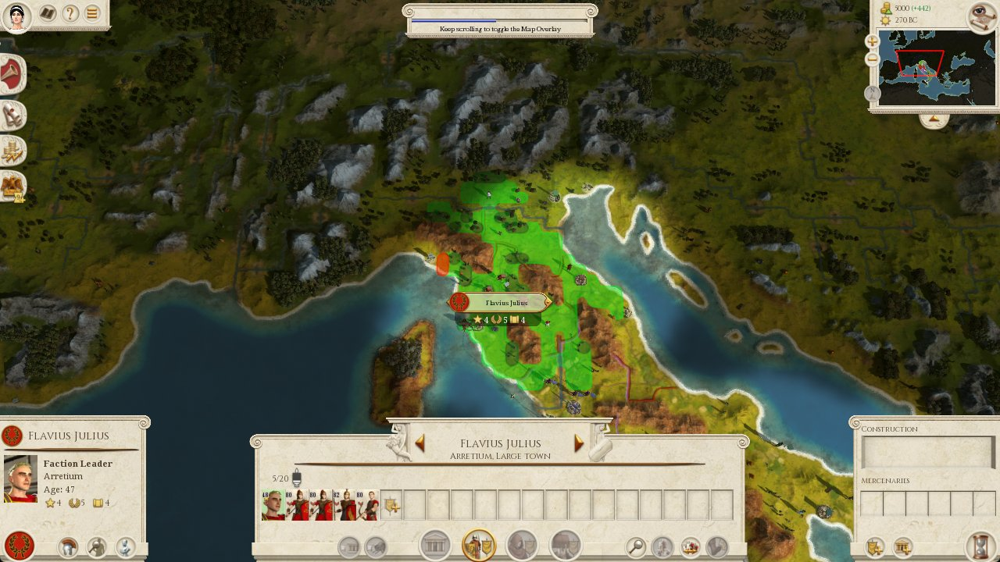
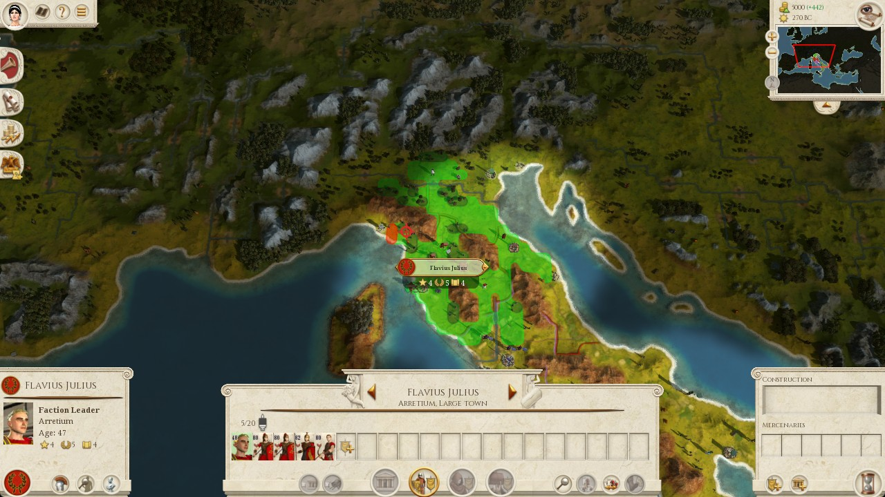

# Handoff: Canonical zoom-out opens Remastered Map Overlay (factions / political view)

**Date:** 2026-09-11  
**Severity:** Blocks map→window march on live phase2 (glyph gate fails; later attempts cascade).  
**Status:** Investigated only — **no fix applied** in this handoff.  
**Ask for next agent:** Change canonical zoom so saturation stays **short of** the scroll-to-toggle Map Overlay threshold; detect overlay / banner; re-derive AABB + `anchor_scale` at the new pose. Do **not** touch projection blend/glyph math except scale tied to the new pose.

**Do not confuse with:** Tab / eye-disc intentionally opening Map Overlay, or the earlier Escape-dismiss bug that opened the main menu and left AABB stuck ~50 map units.

---

## 1. Executive summary

1. Live phase2 (`--directives --seconds 12`) on game turn 6 ordered **march Flavius Julius → Segesta**.
2. March reset camera with `point_to_north` then **~42× `zoom_out` (X)** (`zoom_out_saturate_presses: 40` + 2) aiming for “quantization max-out” (`zoom_steps_from_max_out: 0`).
3. On Rome Remastered, continuing to zoom out past a threshold shows **“Keep scrolling to toggle the Map Overlay”** and then opens the **Map Overlay** (political / factions colour view — what the operator called the “factions map”).
4. Pose verify still passed (`aabb_w=82.1` ≈ expected `80.8`) because the **radar frustum still exists** on that surface.
5. Projection + hover then got **no move cursor** (`no_move_cursor`). Atlas already documents: overlay **replaces the 3D map**; clicks do not order marches.
6. UI mode classifier kept reporting `local_mode=campaign_map conf=0.70` — **misleading**. Evidence is the miss frame banner + glyph failure, not the classifier.
7. Attempts 2–4 are fallout: `pose_unverified:quiesce_timeout` → sticky “notice only” parchment loops (likely army HUD misread) → `stack_not_selected`. Operator aborted with Ctrl+C mid attempt 4 AO wait.

**Smoking gun asset** (committed under docs — `data/runtime/` is gitignored):



Top-centre banner: **“Keep scrolling to toggle the Map Overlay”** (progress bar nearly full).

---

## 2. Symptom (operator) vs mechanism

| Operator saw | Mechanism |
|--------------|-----------|
| Stuck on “factions map”, clicks doing nothing | Remastered **Map Overlay** (Factions radio among overlay layers), entered via **zoom-scroll toggle**, not via Tab |
| Clicks / march appear to hang | Overlay is read-only as a map: hover never becomes move glyph → march refuses |
| Vision still says `campaign_map` | Classifier does not distinguish Map Overlay from 3D strat map at conf 0.70 |

**Not this run’s root cause:**

- Tab / eye disc (no evidence in trail of intentional overlay open).
- Escape dismiss (already removed from pose reset; earlier same-day run showed `aabb_w=50.3` when Escape stole focus — different failure).

---

## 3. Environment & command

| Piece | Detail |
|--------|--------|
| Host | Windows game box |
| Game | Total War: ROME REMASTERED, window `1296x759` (client norms use `1280x720`) |
| Entry | `python scripts/run_phase2_actuation.py --directives --seconds 12` |
| Countdown | 12s “click Rome and leave it focused” |
| Loop | 20 attempts; vision dismiss + observe + End Turn on readiness |
| Directives | Blocking AO each turn via `data/runtime/directive.json` |
| March | `use_map_vision=True`, abort 600s, min_conf 0.55 |
| Combat lists row | `(0.3, 0.415)` |
| Game turn | 6 throughout (stuck retrying same turn) |
| Overlay | Process B pid `152716`, events `127.0.0.1:9876` |
| Elevation | `python_admin=False`, `game_elevated=False` |

**Canonical camera config at time of failure** (`config/default.yaml` → `campaign.camera`):

```yaml
canonical_pose:
  rotation: north_up
  tilt: fixed
  zoom_steps_from_max_out: 0   # stay at max-out after saturate
zoom_out_saturate_presses: 40  # ~34 measured to AABB clamp + margin
quiesce:
  stable_frames: 3
  timeout_s: 4.0
verify:
  expected_aabb_width_map: 80.8
  aabb_width_tolerance_map: 8.0
reset_sequence: locate_then_reset
```

Bindings: `point_to_north=pageup`, `zoom_out=x`, `zoom_in=z`.

Implementation: `CameraPoseDirector.reset_zoom()` taps `zoom_out` **`saturate + 2`** times, then `zoom_in` `zoom_steps_from_max_out` times (0 here). See `src/comstar_game_ai/game_io/campaign/camera_pose.py`.

Design doc that chose max-out: `docs/design/map-window-projection.md` § Canonical camera pose (written 2026-09-11). **That doc did not yet know max-out coincides with Map Overlay toggle.**

---

## 4. Asset inventory (this incident)

Evidence **frames are in-repo** under `docs/design/assets/map-overlay-zoom/`. Original capture paths under `data/runtime/` remain on the game box (gitignored by `data/`).

### 4.1 Primary evidence (committed)

| Path | Size | Captured | Role |
|------|------|----------|------|
| [`design/assets/map-overlay-zoom/20260911-103815_segesta-miss.jpg`](design/assets/map-overlay-zoom/20260911-103815_segesta-miss.jpg) | ~189 KiB | 10:38:15 | Vision miss — **Map Overlay toggle banner** |
| [`design/assets/map-overlay-zoom/20260911-103822_miss_segesta-debug.jpg`](design/assets/map-overlay-zoom/20260911-103822_miss_segesta-debug.jpg) | ~239 KiB | 10:38:22 | Projection debug after glyph miss |
| `data/runtime/phase2_live_20260911-103631.log` (local only) | ~7.1 KiB | 10:36:31 → 10:41:17 | Operator-facing trail |
| `data/runtime/deliberate_20260911-103631.log` (local only) | ~23 KiB | 10:36:33 → 10:41:15 | AO / hold-floor / vision timestamps |

Local originals (same bytes as the committed JPGs):

- `data/runtime/map_target_misses/20260911-103815_segesta.jpg`
- `data/runtime/map_projection_debug/20260911-103822_miss_segesta.jpg`

### 4.2 Session sidecar files (touched during run)

| Path | Notes |
|------|--------|
| `data/runtime/directive.json` | Last directive payload (~10:41) |
| `data/runtime/standing_directive.json` | Standing besiege after hold-floor |
| `data/runtime/ao_agent_status.json` | Agent status snapshot |
| `data/runtime/campaign_predictions.jsonl` | Predictor / candidates (Segesta weaker, etc.) |
| `data/runtime/campaign_id_map.json` | ID map |

### 4.3 Same-day related prior run (Escape / wrong AABB — different bug)

| Path | Role |
|------|------|
| `data/runtime/phase2_live_20260911-102833.log` | Earlier attempt: pose `ok=False` `aabb_w=50.3` vs expected `80.8` (`aabb_width`) — zoom never applied on map because Escape opened menu/help. Motivated removing Escape from pose reset. |
| `data/runtime/deliberate_20260911-102833.log` | Matching deliberate log |

### 4.4 What the miss frame shows (20260911-103815)


- Top-centre parchment banner: **“Keep scrolling to toggle the Map Overlay.”** Progress bar nearly complete.
- Flavius Julius selected south of Arretium; green movement range visible.
- Bottom army parchment panel (5/20 cards); left character card; top-right treasury 5000 / 270 BC / minimap frustum over Italy.
- Terrain / colouration consistent with overlay transition or overlay-adjacent state (operator: “factions map”).

### 4.5 What the projection debug frame shows (20260911-103822)



- Captured ~7s after miss frame during glyph ladder failure.
- Still Flavius selected; army + character HUD parchment prominent.
- Used later when UI sync logged `VISION panel: notice only (parchment_ratio=0.205, …)` — that ratio is consistent with **persistent army HUD parchment**, not a modal notice with a close X. Secondary confusion on attempts 3–4, not the root cause of overlay entry.

---

## 5. Execution sequence & timings

Clock source: `deliberate_20260911-103631.log` (ISO timestamps) cross-checked with trail file names and phase2 trail order. All times local game-box (EDT).

### 5.1 Bootstrap

| Time | Event | Δ from prior |
|------|--------|--------------|
| 10:36:31 | phase2 trail opens; game window OK; telemetry OK | — |
| 10:36:33 | deliberate log starts; answer cache asserted off | +2s |
| 10:36:36.16–.19 | All AO agents `starting` → `ready` (incl. `campaign_director`, `map_target_vision`) | ~3s |
| 10:36:36.19 | Reach session active; sync deliberator ready | — |
| 10:36:36 → ~10:36:48 | 12s countdown (“click Rome…”) | 12s |
| 10:36:49 | INFO starting / ATTEMPT 1 begins (approx.; first AO block at 10:36:49.282) | — |

### 5.2 Attempt 1 — pose “ok”, overlay threshold, march refuse

| Time | Event | Duration / notes |
|------|--------|------------------|
| 10:36:49.282 | Block on AO director turn 6 (ceiling 1860s) | — |
| 10:36:49.301 | `campaign_director` busy `direct_agent` | — |
| 10:37:11.905 | Director `ready run_end` | **~22.6s** first call |
| 10:37:11.920 | Hold floor **reask** (model held; predictor Segesta weaker 1 turn) | — |
| 10:37:11.920 | Second `direct_agent` busy | — |
| 10:37:35.742 | Second call `ready run_end` | **~23.8s** |
| 10:37:35.744 | Hold floor **upgrade** → `besiege` Flavius → Segesta | Trail: `AO answered: besiege` |
| ~10:37:35–10:37:50 | Orders: halt_ai, list_characters, **march**, run_ai; Lists select Flavius OK | Trail: `MARCH select: … verified` |
| ~same window | **Pose reset** → `MARCH pose: ok=True rot=point_to_north w=82.1 h=53.2 aspect=1.543 centre=(68.9,83.1) expected_w=80.8` | Zoom saturation lands at AABB that matches expected **and** overlay threshold |
| Trail | Project: map `(83,84)` → client `(0.445,0.462)`; calib `army_anchor scale=0.0092`; from `(89,82)` dist 6.3 | — |
| 10:37:50.460 | Ada yield acquired `holder=march reason=map_target:segesta` | — |
| 10:37:50.531 | `map_target_vision` busy | — |
| 10:38:15.976 | Vision **unparseable** raw=`red SEGESTA nameplate left of selected army` | **~25.4s** vision |
| 10:38:15 | Miss frame saved `…/20260911-103815_segesta.jpg` | Banner visible |
| 10:38:22 | Debug frame `…/20260911-103822_miss_segesta.jpg` | — |
| Trail | Glyph ladder: five client points all `:same` → **`MARCH refused: no_move_cursor`** | Primary refusal |
| Trail | `ATTEMPT 1/20 … FAIL` | Attempt 1 wall ≈ **~1m34s** from 10:36:49 |

**Key numbers from attempt 1 trail:**

```
MARCH pose: ok=True … w=82.1 h=53.2 aspect=1.543 … expected_w=80.8 failed=[]
MARCH client=1280x720 … from=(89.0,82.0) to=(83.0,84.0) label=segesta … dist=6.3 projection=True
MARCH calib: army_anchor scale=0.0092 at map=(89.0,82.0)
MARCH project: map=(83.0,84.0) → client=(0.445,0.462) …
MARCH vision: unparseable for 'segesta' raw='red SEGESTA nameplate left of selected army'
MARCH project: no cursor glyph — tried (0.459,0.466):same; … (0.440,0.460):same
MARCH refused: no_move_cursor
```

### 5.3 Attempt 2 — quiesce timeout

| Time | Event | Notes |
|------|--------|--------|
| 10:38:23.623 | AO block turn 6 again | — |
| 10:38:23–10:38:48 | Director + hold-floor reask | ~25s first call |
| 10:38:48–10:39:10 | Second call → `besiege` (standing / accept) | ~22s |
| Trail | Select Flavius OK again | — |
| Trail | **`MARCH refused: pose_unverified:quiesce_timeout`** | Frustum never stable within `quiesce.timeout_s: 4.0` (camera still settling / overlay animation / wrong surface) |
| ~10:39:10+ | Attempt 2 FAIL | — |

### 5.4 Attempt 3 — “notice only” loop → stack_not_selected

| Time | Event | Notes |
|------|--------|--------|
| Trail | Four× `VISION inspect: local_mode=campaign_map conf=0.70` + `VISION panel: notice only (parchment_ratio=0.205, no decision, no close X); leaving it and continuing` | Sync UI thrash; parchment likely army HUD |
| 10:39:30.211 | AO block | — |
| 10:39:30–10:39:50 | Director + reask | ~20s |
| 10:39:50–10:40:13 | Second call → upgrade besiege | ~23s |
| 10:40:21.550 | Lists row `(0.3, 0.415)` → **0 unit cards** | — |
| 10:40:27.750 | Retry `.455` → 0 cards | — |
| 10:40:33.953 | Retry `.495` → 0 cards | — |
| 10:40:40.149 | Retry `.535` → 0 cards → **`stack_not_selected`** | ~19s of failed selects |
| Trail | Attempt 3 FAIL | — |

### 5.5 Attempt 4 — aborted mid AO

| Time | Event | Notes |
|------|--------|--------|
| Trail | Same four× notice-only inspect loop | — |
| 10:40:42.785 | AO block turn 6 | — |
| 10:41:04.296 | Hold floor reask | ~21s |
| 10:41:04.298 | Second `direct_agent` started | — |
| 10:41:15.918 | `direct_agent failed: … session stopped` | Operator **KeyboardInterrupt** |
| Trail | `OK overlay closed` + traceback in `run_phase2_actuation.py` → `_block_on_ao` → `fut.result` | End of run ~10:41:17 |

**Wall clock (start countdown end → interrupt):** ~10:36:49 → 10:41:15 ≈ **4m26s**, four attempts, **zero successful marches**, stuck on turn 6.

---

## 6. Causal chain (ordered)

```
Lists locate Flavius (3D map, OK)
    → CameraPoseDirector.ensure_canonical
        → point_to_north (PageUp)
        → zoom_out × (40+2)   ← crosses Remastered “scroll to toggle Map Overlay”
        → zoom_in × 0
        → quiesce + verify AABB ≈ 80.8  ← PASSES (false confidence)
    → project Segesta to client norms
    → map_target_vision (sees “SEGESTA” textually but unparseable JSON)
    → hover ladder: cursor never becomes move glyph
    → refuse no_move_cursor
    → retries on degraded / overlay / unsettled camera
        → quiesce_timeout
        → UI sync misreads army parchment as notice
        → Lists select fails → stack_not_selected
```

**Design contradiction:**  
`docs/design/map-window-projection.md` defines canonical zoom as “fully zoomed out to the engine clamp.” On Remastered, that clamp (or the presses used to guarantee it) is **past or at** the Map Overlay scroll toggle. Expected AABB was fitted **at that same bad zoom**, so verify cannot catch the overlay.

---

## 7. Atlas / product knowledge (already in repo)

Map Overlay is a known **wrong surface for orders**:

- `overlay/agent_skills/campaign_info_sources.md` / `.yaml`:  
  *“The overlay replaces the 3D map. A click inside the view does not move the camera.”*
- `ui_atlas` panel `campaign_map_overlays`: opened by eye disc or **Tab** (moderntw); leave via Escape or toggle again; **no close X**; Factions is a **radio** among overlay layers.
- Remastered **additionally** offers zoom/scroll to toggle the same overlay — evidenced only by live banner on 2026-09-11; **not yet** written into design pose section.

Classifier / dismiss path does not treat Map Overlay as a distinct `local_mode`, so phase2 keeps saying `campaign_map`.

---

## 8. Related code & docs to read before fixing

| Path | Why |
|------|-----|
| `src/comstar_game_ai/game_io/campaign/camera_pose.py` | `reset_zoom`, `ensure_canonical`, quiesce, verify |
| `src/comstar_game_ai/game_io/campaign/march.py` | `require_canonical_pose`, `no_move_cursor`, select refuses |
| `src/comstar_game_ai/game_io/campaign/map_projection.py` | `DEFAULT_ANCHOR_SCALE = 0.0092` (tied to AABB 80.8) |
| `config/default.yaml` → `campaign.camera` | Live knobs |
| `docs/design/map-window-projection.md` § Canonical camera pose | Must be amended when zoom policy changes |
| `docs/cursor-handoff.md` §3.4 | Wrong game state silent failure; pose is part of state |
| `scripts/accept_camera_pose_reset.py` | Live pose acceptance |
| `scripts/accept_map_projection_march.py` | March acceptance after pose |

---

## 9. Recommended fix direction (not done)

1. **Canonical zoom = max-out minus N** where N is the smallest integer that never shows the “Keep scrolling to toggle the Map Overlay” banner and never leaves Map Overlay active. Prefer measuring with a dedicated spike (zoom out until banner appears, then zoom in 1–N and record AABB).
2. Set `zoom_steps_from_max_out: N` (or reduce saturate presses to stop before toggle) and **re-measure** `expected_aabb_width_map` + re-derive `anchor_scale` (`viewport_width_client / aabb_w`). Update design doc; if multiple zooms ever exist, use a table `(steps → scale)` as already prescribed.
3. **Detect** overlay / banner before project: OCR or template for the toggle string; or atlas mode bit if available; or refuse `wrong_surface:map_overlay` instead of `pose_ok` + `no_move_cursor`.
4. **Recover:** if overlay detected, Tab/eye toggle off or zoom-in until banner gone, then re-quiesce/verify.
5. Do **not** treat glyph miss alone as enough without surface check — but glyph miss remains a correct last-line refusal.
6. Optionally harden UI sync so army parchment (`parchment_ratio≈0.20`, no close X, character selected) is not spun as “notice only” four times per attempt.

**Out of scope for this fix:** projection blend ladder / glyph templates, AO timeouts, hold-floor policy (worked as designed: upgraded hold → besiege).

---

## 10. Acceptance criteria for the fix

- After pose reset, miss/debug frames must **not** show “Keep scrolling to toggle the Map Overlay” or Map Overlay legends.
- Pose verify passes at the **new** expected AABB (not the old 80.8 unless re-confirmed at safe zoom).
- Near-path march to Segesta from Flavius on turn-6-like start gets a move glyph within the existing hover ladder (live accept script green).
- Classifier may still say `campaign_map`; surface guard must not rely on it alone.
- Prior Escape bug remains fixed (no Escape in pose reset).

---

## 11. Reproduction (when operator is ready)

1. Game on Julii campaign map, turn ≈6, Rome focused, no menus.
2. `python scripts/run_phase2_actuation.py --directives --seconds 12`
3. Watch for `MARCH pose: ok=True` with `w≈80–85` immediately followed by miss frame banner or `no_move_cursor`.
4. Inspect newest file under `data/runtime/map_target_misses/`.

Optional isolated probe: drive only `CameraPoseDirector.ensure_canonical` / `accept_camera_pose_reset.py` and screenshot after saturate — confirm banner without full AO loop.

---

## 12. One-line root cause

**Canonical zoom saturation (`X` × ~42 to AABB≈80.8) triggers Remastered’s scroll-to-toggle Map Overlay; pose verify trusts that AABB, then march fails closed-loop because orders are invalid on the overlay.**
