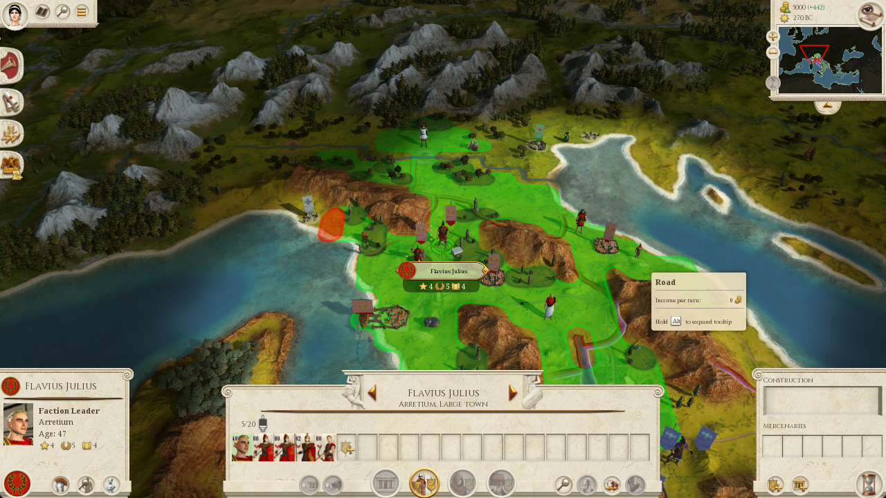
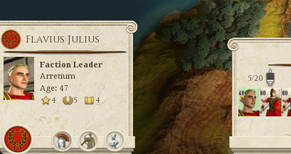
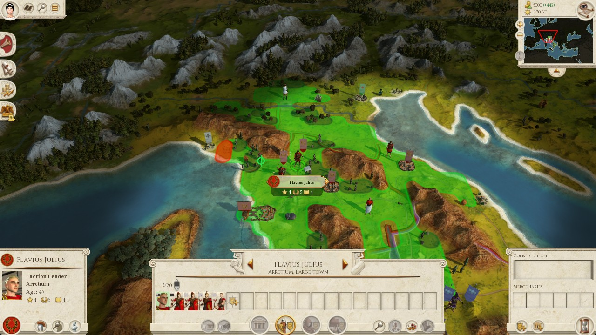
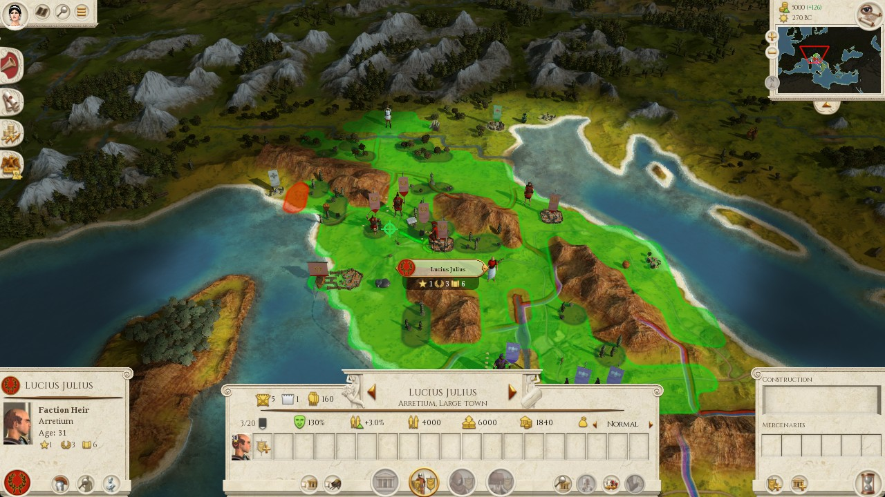
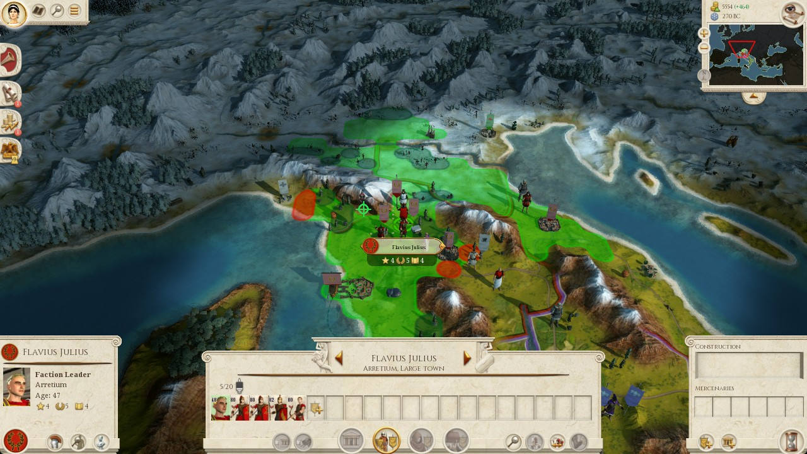
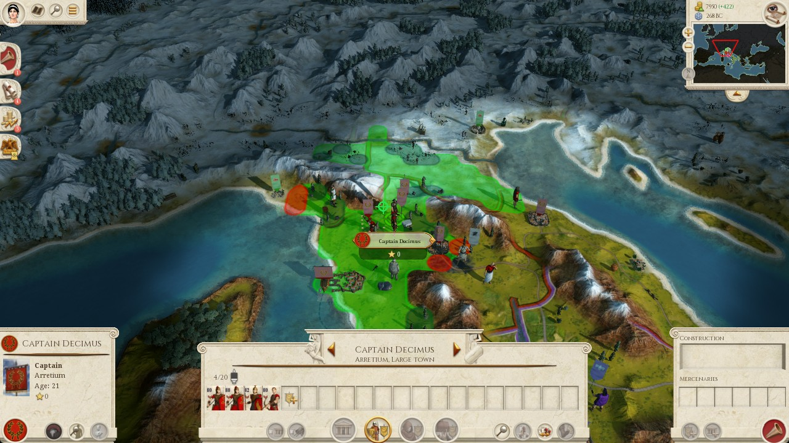

# Phase 2 false-march investigation — 2026-09-11

**Run:** `python scripts/run_phase2_actuation.py --directives --seconds 12`  
**Trail:** [`design/assets/phase2-false-march-20260911/phase2_live_20260911-122707.log`](design/assets/phase2-false-march-20260911/phase2_live_20260911-122707.log)  
**AO / deliberate:** [`design/assets/phase2-false-march-20260911/deliberate_20260911-122707.log`](design/assets/phase2-false-march-20260911/deliberate_20260911-122707.log)  
**Report:** [`design/assets/phase2-false-march-20260911/phase2_report.json`](design/assets/phase2-false-march-20260911/phase2_report.json)  
**Evidence frames:** [`design/assets/phase2-false-march-20260911/`](design/assets/phase2-false-march-20260911/)

## Verdict

The run did **not** successfully march Flavius Julius to Segesta. After attempt 1, pose/scale looked healthy and six cycles printed `MARCH ordered`, but those orders were mostly **false positives**: stale belief coordinates + a loose radar-frustum identity gate + glyph-on-green-land. Belief then “walked” Flavius to Segesta on paper. The run ended on a **UI/modal `turn_failed` circuit breaker**, not on a march refusal.

Canonical pose / Z7 (`zoom_steps_from_max_in: 14`, AABB `55.6`, scale `0.0133`) behaved correctly. The failure is above that layer: **belief identity and destination truth**.

---

## Ground truth before / beside the run

Live Flavius is **Faction Leader at Arretium**, not near Segesta. Frustum centre after Lists-locate sits near **`(67.5, 87.1)`**. Belief still carried the old Segesta-near start **`(89, 82) → (83, 84)`**.





Earlier the same day, a **real** short west order at the Z7 pose landed (boots glyph, destination crosshair beside Flavius). That is what Z7 was fitted from — not this phase2 Segesta path.



---

## Report summary

```json
{
  "turns": {
    "turns_ok": 6,
    "turns_failed": 3,
    "requested": 20,
    "desyncs": 3,
    "circuit_breaker": 1,
    "game_turn_start": 5,
    "game_turn_end": 6,
    "turns_advanced": 5,
    "turn_baseline_resets": 1,
    "attacks_ordered": 0,
    "battles_resolved": 0
  },
  "directives": {
    "enabled": true,
    "blocking": true,
    "last": "besiege"
  },
  "state": "campaign_map"
}
```

Trail footer also notes: Rome’s saves folder still holds an earlier campaign, so turn endpoints are not a measure of this run.

---

## Root cause chain

### 1. Belief world ≠ live world (primary)

| Space | Flavius | Segesta |
|-------|---------|---------|
| Live (radar frustum / HUD) | Arretium ≈ `(67.5, 87.1)` | Sicily — not on the Arretium frame |
| Belief at run start | `(89, 82)` | `(83, 84)` |
| Belief at run end | `(83, 84)` `provenance: own_order` | `(83, 84)` |

AO / hold-floor every turn upgraded hold → **besiege Flavius → Segesta** because the predictor still saw a weak slave Segesta in **1 turn** (later **0**). The model often said hold / `missing_actor_or_target`; the floor forced besiege.

### 2. Frustum identity check is too loose for this geometry

`ARMY_FRUSTUM_MATCH_MAP = 22`. Select does **not** OCR the HUD name; `who=Flavius Julius` is the ordered string.

Distance from Arretium frustum `(67.5, 87.1)` to stale belief `from`:

| belief `from` | dist | gate (≤22) |
|---------------|------|------------|
| `(89, 82)` | ≈22.1 | **fail** (attempt 1 pose) |
| `(88, 82)` | ≈21.1 | **pass** |
| `(87, 82)` | ≈20.2 | pass |
| … stepping west … | shrinks | **easier pass** |

As belief fake-marches Flavius **toward** Segesta (decreasing x), the broken check against the **Arretium** camera gets **more** likely to pass.

Deliberate-log frustum lines (abbreviated):

```text
frustum centre=(69.5,90.3) from=(89.0,82.0) dist=21.2 match=True   # attempt 1 select
… pose failed after reset at (67.5,87.1) …
frustum centre=(67.5,87.1) from=(89.0,82.0) dist=22.0 match=False  # attempt 2 row 0.415
frustum centre=(69.5,86.3) from=(89.0,82.0) dist=19.9 match=True   # attempt 2 row 0.455
frustum centre=(67.5,87.1) from=(88.0,82.0) dist=21.1 match=True
… from=(87…84) dist 20.1 → 17.0 match=True …
```

### 3. “Ordered” ≠ marched to Segesta

Pipeline: army-anchor at belief `from` → project belief Segesta → hover until **any** cursor handle change → right-click.

Near Arretium, probes around `(0.44–0.49, 0.46)` sit on **local green movement / roads**. Glyph changes → closed-loop success. Belief `list_characters` / step updates then moved Flavius along `(89 → 83)`, so the director thought progress was real. Predictor `turns_to_reach` went **1 → 0**; attempt 8 stopped issuing march.

### 4. Canonical pose / Z7 were fine

When pose ran: AABB `w=55.6` matched expectation, Z3 `is_map_overlay: False`, scale `0.0133` used. This was **not** the old overlay / `anchor_scale_unset` failure.

### 5. Turn-number chaos (secondary)

Start `game_turn=6` → after End Turn, “Rome handed turn **2** back”. Desyncs=3 are saves-folder bookkeeping, not the march bug.

### 6. How the run died (attempts 8–9)

Not march. On turn 7: no march (belief “arrived”) → End Turn did not register → modal dismiss loop (false close-X near minimap/search) → Z8 identical `(turn_failed, 7, "7")` twice → overlay FAULT → run end. Asyncio pipe noise at shutdown is teardown after hard stop.

---

## Sequence of events

### Attempt 1 — correct refusal

```text
AO answered: besiege
orders: halt_ai julii, list_characters, march Flavius Julius toward segesta, run_ai
MARCH select: row (0.3, 0.415) verified via frustum who=Flavius Julius cards=1
MARCH pose: ok=False … centre=(67.5,87.1) expected_w=55.6 failed=['frustum_centre']
MARCH refused: pose_unverified:frustum_centre
FAIL turn cycle
```

### Attempt 2 — first false success (wrong character)

```text
MARCH select: row (0.3, 0.415) frustum ≠ Flavius Julius from=(89.0,82.0) — next row
MARCH select: row (0.3, 0.455) verified via frustum who=Flavius Julius cards=1
MARCH pose: ok=True … centre=(69.5,86.3) expected_w=55.6
MARCH calib: army_anchor scale=0.0133 at map=(89.0,82.0)
MARCH ordered click=(0.440,0.460) … step=(88.05, 82.32)
… End Turn … Rome handed turn 2 back …
```



### Attempt 3 — Flavius at Arretium, local marker (not Segesta)

```text
from=(88.0,82.0) to=(83.0,84.0) dist=5.4
MARCH ordered click=(0.450,0.460) … step=(87.07, 82.37)
… diplomacy reject during wait …
Rome handed turn 3 back
```



### Attempts 4–6 — belief walks west; still “ordered”

| Attempt | belief `from` | click (approx) | step (belief) | frame |
|---------|---------------|----------------|---------------|-------|
| 4 | `(87, 82)` | `(0.460, 0.460)` | `(86.1, 82.4)` | [04-hit.jpg](design/assets/phase2-false-march-20260911/04-hit.jpg) |
| 5 | `(86, 82)` | `(0.470, 0.460)` | `(85.2, 82.6)` | [05-hit.jpg](design/assets/phase2-false-march-20260911/05-hit.jpg) |
| 6 | `(85, 83)` | `(0.480, 0.470)` | `(84.1, 83.4)` | [06-hit.jpg](design/assets/phase2-false-march-20260911/06-hit.jpg) |

Turn 5 also: notice-only parchment left alone; alert panel reject + close X cleared.

### Attempt 7 — last march; wrong stack again

```text
from=(84.0,83.0) to=(83.0,84.0) dist=1.4
MARCH ordered click=(0.486,0.466) … step=(83.29, 83.71)
Rome handed turn 7 back
```



### Attempt 8 — “arrived”; End Turn fails

Deliberate: `turns_to_reach: 0` for Segesta.

```text
AO answered: besiege
orders: halt_ai julii, list_characters, run_ai    # no march
… scroll / panel dismiss …
WARN End Turn did not register
FAIL
```

### Attempt 9 — modal loop → circuit breaker

```text
VISION scroll: floating notice, close X=(0.872,0.105); clicking   # ×4
skip — state=campaign_modal ui=modal
FAIL circuit_breaker: turn_failed turn=7 state_hash=7
```

```text
circuit breaker — ending run (circuit_breaker: turn_failed turn=7 state_hash=7);
previous_key=('turn_failed', 7, '7')
```

---

## Full phase2 console trail

Source file (committed): [`phase2_live_20260911-122707.log`](design/assets/phase2-false-march-20260911/phase2_live_20260911-122707.log)

```text
OK  game_window: 'Total War: ROME REMASTERED' 1296x759
OK  trail: D:\Projects\comstar-game-ai\data\runtime\phase2_live_20260911-122707.log
OK  telemetry ok: message_log.txt and scripting_log.txt both present
INFO elevation: python_admin=False game_elevated=False matched_marker=False
INFO combat: auto_resolve=True attack=False targets=0 lists_row=(0.3, 0.415)
INFO march: use_map_vision=False abort_s=600.0 min_conf=0.55 (ready via AO agent_state)
INFO directives: blocking AO each turn via data\runtime\directive.json
INFO bootstrap_from_logs: 0 records
INFO state after bootstrap: campaign_map turn=None turns_seen=0
INFO running 20 attempts (vision dismiss + observe + End Turn on readiness)...
OK  overlay up (pid 176000)
OK  publishing overlay events to 127.0.0.1:9876
INFO starting AO session (blocks until agent ready)...
OK  AO deliberator ready — log: data\runtime\deliberate_20260911-122707.log
INFO click Rome and leave it focused — starting in 12s
…
INFO starting
ATTEMPT 1/20 game_turn=6  sync UI on turn 6
VISION inspect: local_mode=campaign_map conf=0.70 detail=high_center_variance turn=6
ATTEMPT 1/20 game_turn=6  waiting for AO on turn 6
INFO AO agent: campaign_director busy direct_agent
ATTEMPT 1/20 game_turn=6  AO answered: besiege
ATTEMPT 1/20 game_turn=6  directive: besiege
ATTEMPT 1/20 game_turn=6  orders on turn 6: halt_ai julii, list_characters, march Flavius Julius toward segesta, run_ai
MARCH select: row (0.3, 0.415) verified via frustum who=Flavius Julius cards=1
MARCH pose: ok=False rot=point_to_north w=55.6 h=41.9 aspect=1.327 centre=(67.5,87.1) expected_w=55.6 failed=['frustum_centre']
MARCH refused: pose_unverified checks=[frustum_centre] aabb_w=55.6 aabb_h=41.9 aspect=1.327 expected_w=55.6
MARCH refused: pose_unverified:frustum_centre
ATTEMPT 1/20 game_turn=6  FAIL  turn cycle failed or timed out
ATTEMPT 2/20 game_turn=6  sync UI on turn 6
…
MARCH select: row (0.3, 0.415) frustum ≠ Flavius Julius from=(89.0,82.0) — next row
MARCH select: row (0.3, 0.455) verified via frustum who=Flavius Julius cards=1
MARCH pose: ok=True rot=point_to_north w=57.0 h=40.3 aspect=1.412 centre=(69.5,86.3) expected_w=55.6 failed=[]
MARCH surface: {… 'is_map_overlay': False, 'detail': 'textured_map'}
MARCH client=1280x720 … from=(89.0,82.0) to=(83.0,84.0) label=segesta …
MARCH calib: army_anchor scale=0.0133 at map=(89.0,82.0)
MARCH project: map=(83.0,84.0) → client=(0.420,0.453) …
MARCH ordered click=(0.440,0.460) … step=(88.051…, 82.316…)
…
ATTEMPT 2/20 game_turn=6  Rome handed turn 2 back
ATTEMPT 2/20 game_turn=6  OK  turn cycle complete
… attempts 3–7: same besiege → march pattern; from walks 88→84; each MARCH ordered …
ATTEMPT 8/20 … orders: halt_ai julii, list_characters, run_ai
… WARN End Turn did not register → FAIL …
ATTEMPT 9/20 … scroll close X=(0.872,0.105) ×4 → skip campaign_modal → FAIL
ATTEMPT 9/20 game_turn=7  FAIL  circuit_breaker: turn_failed turn=7 state_hash=7
WARN  turns_ok=6 turns_failed=3 desyncs=3
OK  campaign advanced 5 turns (endpoints seen: 5 -> 6)
INFO turn baseline re-read 1x — Rome's saves folder still holds an earlier campaign…
OK  belief_history=26 armies=5 settlements=8
OK  attacks_ordered=0 battles_auto_resolved=0
OK  last directive: besiege
FAIL Phase 2 — circuit breaker: identical refusal on the same turn (overlay FAULT published; run ended)
```

(Full verbatim log is in the asset file linked above; console paste in the operator session matches it.)

---

## AO / deliberate highlights

Full log: [`deliberate_20260911-122707.log`](design/assets/phase2-false-march-20260911/deliberate_20260911-122707.log)

Pattern every march turn:

1. Model hold → hold-floor **reask** (reachable weaker Segesta via Flavius, `turns_to_reach: 1`).
2. Second pass → hold-floor **upgrade** to `besiege gen_flavius_julius -> set_segesta` (`missing_actor_or_target`).
3. Driver issues mouse march; logs `march ordered` or (attempt 1) `pose_unverified:frustum_centre`.

Turn 7:

```text
turns_to_reach: 0
… standing directive … still in progress. The target is reachable and the general is idle.
… circuit breaker — ending run (circuit_breaker: turn_failed turn=7 state_hash=7)
```

Belief refresh lines show the turn-number jump after attempt 2:

```text
belief advanced turn=6 …
belief advanced turn=2 elapsed=1 …
belief advanced turn=3 …
… turn=7 …
```

---

## Asset index

| File | Role |
|------|------|
| `00-flavius-arretium-truth.png` | Live Flavius at Arretium (ground truth) |
| `00-flavius-hud.png` | HUD crop — Faction Leader, Arretium |
| `01-z7-true-west-order.jpg` | Earlier same-day true west order at N=14 |
| `02-hit-lucius-not-flavius.jpg` | Attempt 2 “hit” — Lucius selected |
| `03-hit-flavius-arretium-local.jpg` | Attempt 3 — Flavius, local marker only |
| `04-hit.jpg` … `06-hit.jpg` | Attempts 4–6 ordered frames |
| `07-hit-decimus-not-flavius.jpg` | Attempt 7 — Decimus selected |
| `phase2_live_20260911-122707.log` | Full phase2 trail |
| `deliberate_20260911-122707.log` | Full AO / hold-floor / march logger |
| `phase2_report.json` | Machine summary |

---

## One-line summary

**Stale Flavius/Segesta belief + a 22-map-unit frustum gate let the wrong (or right-but-misaimed) army click green land and report success; belief then “arrived” at Segesta; the run stopped later on repeated End-Turn/modal failure, not on pose/scale.**

## Ask for next agent (not done here)

- Refresh character coords from live `list_characters` / HUD before march; do not trust `own_order` steps alone when frustum disagrees by tens of map units.
- Tighten or replace frustum identity (OCR name, smaller radius, or require centre ≈ post-locate measure of the *same* row).
- Treat glyph+belief-step as insufficient proof of destination when projected click stays near army centre.
- Separate Z8 `turn_failed` (UI) from march refusals in operator messaging.
